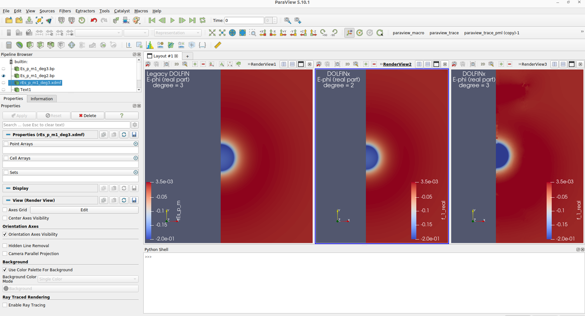

# DOLFINx issue with axisymmetric electromagnetic problems

This repository has been made for showing a DOLFINx issue when solving
axisymmetric Maxwell's equations. In particular, the problem seems to be related
to the `degree` of the finite elements. When using `degree = 2`, the solution
calculated by DOLFINx looks correct, as confirmed by a calculation of the
absorption efficiency, which is pretty close to the analytical value. However,
for `degree = 3` the solution presents some artifacts, which results in
an absorption efficiency not close to its analytical value.  

The image here below compares the solution in legacy DOLFIN with
the solutions in DOLFINx. The DOLFIN version of the code have been
extensively tested against analytical results, and its output therefore its
reliable and does not present any inconsistency using different `degree` for
the finite elements.

## Minimal working examples

In order to understand the issue, I have added the file `dolfinx_mwe.py`, which
is a minimal working example showing the issue when passing from `degree = 2` to
`degree = 3`. The file `legacy_mwe.py` contains the same problem solved in
legacy DOLFIN for a comparison.

## Problem

The problem being solved is the electromagnetic scattering of a plane wave
from a metallic sphere. Due to the symmetry of the problem,
we can exploit the expansion of the field in cylindrical harmonics to simplify
the 3D problems into few 2D problems, corresponding to the multiple cylindrical
harmonics which propagates independently. In particular, the
minimal working examples only solves the problem for the harmonic number `m = 1`.

Here below a quick rundown of the DOLFIN/DOLFINx functions and their corresponding
mathematical representation. The implementation of such functions in DOLFIN is
necessarily more complicated due to the lack of support of complex numbers.

$$
\begin{align}
\sum_{m}\int_{\Omega_{cs}}&-(\nabla \times \mathbf{E}^{(m)}_s)
\cdot (\nabla \times \bar{\mathbf{v}}^{(m)})+\varepsilon_r k_0^{2}
\mathbf{E}^{(m)}_s \cdot \bar{\mathbf{v}}^{(m)}
+k_0^{2}\left(\varepsilon_r
-\varepsilon_b\right)\mathbf{E}^{(m)}_b \cdot \bar{\mathbf{v}}^{(m)}
\end{align}
$$

$$
\begin{align}
\mathbf{E}^{(m)}_b = &\hat{\rho} \left(E_{0} \cos \theta
e^{i k z \cos \theta} i^{-m+1} J_{m}^{\prime}\left(k_{0} \rho \sin
\theta\right)\right)\\
+&\hat{z} \left(E_{0} \sin \theta e^{i k z \cos \theta}i^{-m} J_{m}
\left(k \rho \sin \theta\right)\right)\\
+&\hat{\phi} \left(\frac{E_{0} \cos \theta}{k \rho \sin \theta}
e^{i k z \cos \theta} i^{-m} J_{m}\left(k \rho \sin \theta\right)\right)
\end{align}
$$

$$
\begin{align}
\left(\nabla \times \mathbf{a}^{(m)}\right) = &\left[\hat{\rho}
\left(-\frac{\partial a_{\phi}^{(m)}}{\partial z}
-i \frac{m}{\rho} a_{z}^{(m)}\right)+\\ \hat{\phi}
\left(\frac{\partial a_{\rho}^{(m)}}{\partial z}
-\frac{\partial a_{z}^{(m)}}{\partial \rho}\right)+\right.\\
&\left.+\hat{z}\left(\frac{a_{\phi}^{(m)}}{\rho}
+\frac{\partial a_{\phi}^{(m)}}{\partial \rho}
+i \frac{m}{\rho} a_{\rho}^{(m)}\right)\right]
\end{align}
$$
